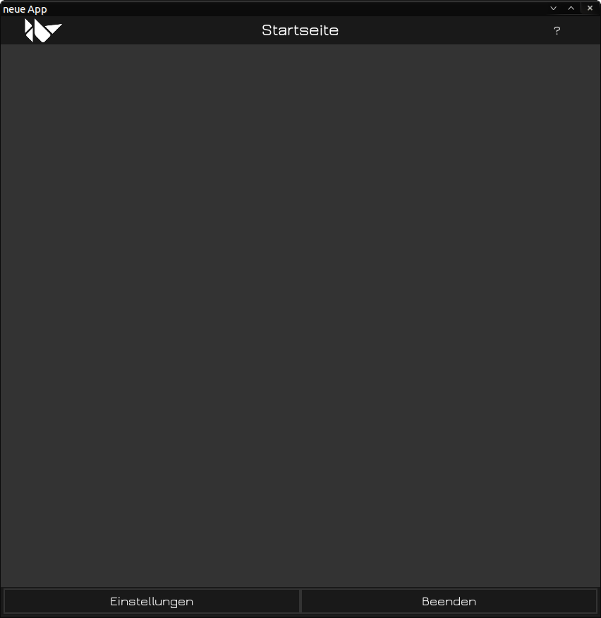
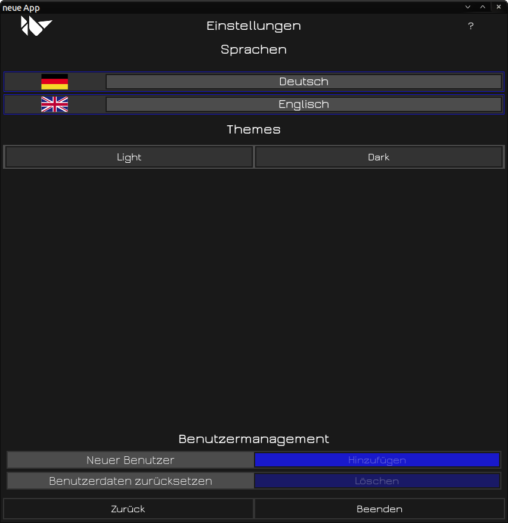

# EmptyKivyTemplate v1.1

## Overview
This is a clean and minimal template for Kivy applications, designed to serve as a starting point for new projects. It includes essential features such as language selection, theme switching (light/dark mode), and optional user management (login/register functionality). The template is highly modular, making it easy to customize and extend for your specific needs.


---

## Features
- **Home Screen:** Displays buttons leading to different pages or actions.
- **Settings Page:** Allows users to:
  - Change the application language (e.g., German/English).
  - Switch between light and dark themes.
- **User Management (Optional):**  
  - Enable or disable user management via the `USER_MANAGEMENT` flag in `constants.py`.
  - Includes login/register functionality and user data reset.
- **Dynamic UI Updates:**  
  - Texts, images, and themes are dynamically updated based on user preferences.
- **Logger Integration:**  
  - Built-in logging for debugging and error tracking.

---

## Requirements
- Python 3.10+
- Kivy 2.3.0+
- Bcrypt 4.3.0+
- Other dependencies listed in `requirements.txt`

---

## Installation

### 1. Clone the Repository
```bash
git clone https://github.com/fl-tech-design/empty_kivy_template.git
cd empty_kivy_template
```

### 2. Create a Virtual Environment (Optional but Recommended)
```bash
python3 -m venv venv
source venv/bin/activate  # On Windows, use `venv\Scripts\activate`
```

### 3. Install Dependencies
```bash
pip install -r requirements.txt
```

### 4. Run the Application
```bash
python3 main.py
```
## Usage

### Working with the Repository

When you clone this repository, you are downloading all the necessary files to work with the basic template, including the `.git` directory, which contains the version control history.

### Start a New Git Repository

If you want to use this template as a base for your own project, you can remove the existing Git history and initialize a new repository:

```bash
# Remove the existing .git directory
rm -rf .git

# Initialize a new Git repository
git init

# Add all files to the staging area
git add .

# Commit the changes
git commit -m "Initial commit"
```

### Push to Your Own GitHub Repository
After creating your own Git repository, you can push it to a new GitHub repository:

```bash
# Link your local repository to a remote repository
git remote add origin <your-repo-url>

# Push the changes to the remote repository
git push -u origin main
```

## Key Features Explained

### 1. Theme Switching (Light/Dark Mode)
The application supports dynamic theme switching between light and dark modes. This is achieved by updating the theme manager and refreshing the UI elements accordingly. The current theme is stored and applied globally.

To switch themes, navigate to the Settings Page and select either "Light" or "Dark" from the theme options.

### 2. Language Selection
Users can choose between multiple languages (e.g., German and English). The selected language is stored in the application's configuration and dynamically updates all text elements.

Language flags are displayed on the Settings Page , and clicking on a flag switches the application language.

### 3. User Management (Optional)
User management can be enabled or disabled via the USER_MANAGEMENT flag in constants.py. When enabled, the application provides the following features:

Login/Register Functionality: Users can create accounts or log in to existing ones.
User Data Reset: Administrators can reset all user data to the default state.
Persistent User Status: The application tracks login status and user preferences.

To enable user management, set <span style="color: #ff0000;">USER_MANAGEMENT</span> = <span style="color: #0000ff;">True</span> in `constants.py`.

## Screenshots
  
*Figure 1: Home Screen with Buttons*

  
*Figure 2: Settings Page with Language Selection and Theme Switching*
